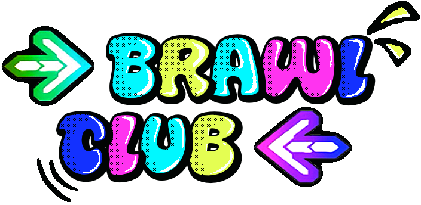

# Relatório
<p align="center">
  
</p>
## Tema do Jogo: Rhythm Game

O tema do jogo é um "Rhythm Game" multiplayer com limite de dois jogadores, onde o objetivo é acertar nas notas musicais com a maior precisão possível, acumulando pontuação ao longo de cada música para vencer o adversário.

O jogo é um jogo de ação onde os dois jogadores jogam em simultâneo, cada um no seu lado do ecrã. O ecrã está dividido ao meio, onde o lado direito pertence ao Player 1 e o lado esquerdo pertence ao Player 2. Cada jogador tem as suas próprias notas a subir pelo ecrã em sincronização com a música, e tem de carregar nas teclas correspondentes no momento certo. No final da música, os scores dos dois jogadores são comparados e o jogador com maior pontuação é declarado vencedor.

Embora eu queira que seja um jogo de ação Host/Cliente, eu não sei se conta pois mesmo que os dois jogadores joguem em simultaneo e vejam um ao outro a jogar, nenhum afeta em si o outro so no final do jogo e que a pontuaçao que cada um teve demonstrara quem ganha sendo a unica coisa que afeta assim em especifico. Mesmo tendo esta duvida acho que o jogo estaria na categoria de jogo de ação pois ambos jogam ao mesmo tempo e não por turnos.

### Como funciona a Gameplay?

Em termos de "gameplay", cada lado do ecrã apresenta quatro setas com diferentes cores representando as direções (esquerda, baixo, cima e direita) posicionadas na zona superior. Durante o jogo, notas correspondentes a essas setas sobem pelo ecrã em sincronização com a música. O jogador deverá pressionar a tecla correta no momento em que a nota atinge a zona de impacto. Consoante a precisão do "timing", a jogada é classificada como Perfect, Great, Good ou Miss, cada uma com uma pontuação diferente associada. O multiplicador de score vai subindo com hits consecutivos e volta a 1 quando o jogador falha uma nota.

<p align="center">
  
</p>

## Desenvolvimento do Rhythm Game

Antes de desenvolver o jogo comecei pesquisar no YouTube tutoriais de como fazer um "rhythm game" no Unity, onde encontrei uma série do canal "gamesplusjames" chamada "How To Make a Rhythm Game". Decidi seguir esta série pois falava de exatamente o que eu precisava, desde o sistema de notas, à música, ao "score" e ao "timing".

#### Tocar Notas
Após encontrar este tutorial comecei por criar o projeto em si e adicionei um "background" que parece um "sidescroller" de uma discoteca cujo os direito de autor são meus pois foi um "asset" que eu comprei no "itch.io", e pus a animação dele a parecer um "sidescroller" e após ter feito isso comecei então por ver o primeiro vídeo da série que fala-va sobre fazer as notas aparecerem e serem detetadas pelo jogador. Segui então o tutorial e criei o **`ButtonController`** que trata das setas fixas no fundo do ecrã, mudando o sprite para o estado pressionado quando o jogador carrega na tecla correspondente e voltando ao normal quando solta, dando "feedback" visual. Criei também o **`NoteObject`** com a lógica que deteta quando a nota entra e sai da zona do "Activator"(Vou falar sobre oque é o Activator mais á frente) através dos "triggers", controlando a variável `canBePressed`. No final quando fui testar deparei-me com um erro, este erro era um erro muito comum em tutoriais antigos de Unity, pois estes videos usam o sistema de input antigo do Unity e como o meu projeto estava configurado para usar o **New Input System** estava a dar este erro. Decidi então atualizar todos os "scripts" de forma a funcionar com o novo InputSystem onde, por exemplo, troca-va o `Input.GetKeyDown(KeyCode.E)` por `Keyboard.current.eKey.wasPressedThisFrame` e usaria `KeyControl` para detetar as teclas.

<p align="center">
  
</p>

#### Musica & Notas falhadas

Com o input a funcionar avancei para o segundo vídeo que fala-va sobre a parte de tocar a música e detetar quando o jogador falhava uma nota. Aqui criei o "script" **`BeatScroller`** sendo este o responsável por mover as notas pelo ecrã em sincronização com o "BPM" da música, convertendo o valor de batidas por minuto para batidas por segundo e movendo tudo no eixo Y a cada frame, só começando quando o jogador carrega em qualquer tecla. Completei também o **`GameManager`** com a parte do `startPlaying` e do `theMusic` para a música começar ao mesmo tempo que o scroll, e adicionei ao **`NoteObject`** a lógica do Miss, onde se o jogador não carregar a tempo a nota é registada como falhada. Após isto para testar fui buscar uma música que tivesse a haver com o estilo de "Party" e encontrei esta música chamada Mirrorball(Sendo as suas categorias de Disco e Dance) em um site com músicas sem "copyright", adicionei a ao projeto e fui ver em outro site qual era o seu BPM, onde o resultado foi 120bpm. Após isso pus então no ispetor do objeto que tem o "script" **`BeatScroller`** 120 para corresponder a música.

#### Resultado e Multiplicador

De seguida comecei por fazer o sistema de "score" e multiplicadores, onde desenvolvi a maior parte do **`GameManager`**. Aqui implementei o `currentScore`, o `currentMultiplier` e o "array" de `multiplierThresholds`, e criei tambem as funções `NormalHit()`, `GoodHit()` e `PerfectHit()` que recebem chamadas do `NoteObject` para atualizar os valores, onde o multiplicador vai subindo com hits consecutivos e volta a 1 quando o jogador falha uma nota. 

#### "Timing" das Notas tocadas

Por fim comecei por fazer o sistema de "timing" e encontrei outro problema, desta vez no sistema de "timing". Não conseguia fazer **Perfect** nem **Great** independentemente de quando carregava na tecla, o resultado era sempre um hit normal (Good). Ao analisar o código apercebi-me que o cálculo da distância estava a medir a posição Y da nota relativamente ao `Y=0` do mundo, ou seja, como as notas nunca passavam pelo `Y=0` do mundo a distância era sempre grande e o resultado era sempre Normal(Good). A solução que eu encontrei para este problema foi adicionar uma referência a um objeto cujo o nome é **Activator**, que está posicionado na zona onde o jogador deve acertar as notas, e este mede tambem a distância entre a nota e o objecto em vez do centro do mundo, corrigindo este erro e agora o Sistema de particulas e os Sprites de **Good**, **Perfect** e **Great**já funcionavam da forma correta. Nesta fase completei também o **`NoteObject`** com toda a lógica de distância e criei o **`EffectObject`**, um "script" simples que destrói os efeitos visuais de feedback ao fim de um tempo.

<p align="center">
  
</p>

#### Personagem e Animações

Após ter feito o timming das notas darem diferentes valores para o score decidi focar em um dos personagens do jogo, onde decidi usar um personagem meu de um projeto anterior, para o qual criei novos "sprites" especificamente para este jogo, desenhando as animações de dança correspondentes às quatro direções (esquerda, direita, cima e baixo), uma animação de "idle" com 10 "frames" e uma animação de "miss". Após ter os "sprites" prontos importei-os para o Unity como uma "spritesheet" e fiz o corte dos "frames" no "Sprite Editor" usando a opção "Slice"(32x32). De seguida criei um "Animator Controller" com os estados "Idle", "Left", "Right", "Up", "Down" e "Missed", onde cada estado tem a animação correspondente e volta ao "Idle" quando termina.

Para ligar as animações ao "gameplay" criei o "script" **`CharacterAnimator`** que recebe chamadas do **`NoteObject`** quando o jogador acerta ou falha uma nota, disparando a animação correta consoante a tecla pressionada. Ao testar deparei-me com dois problemas. O primeiro foi um "NullReferenceException" no **`NoteObject`** porque o `FindObjectOfType<CharacterAnimator>()` não estava a encontrar o "script" na cena, onde eu resolvi adicionando uma verificação de null antes de chamar o **`CharacterAnimator`**. O segundo foi que o personagem estava a ir para a animação de "Left" e voltar ao "Idle" sozinho sem o jogador carregar em nada, pensei que teria sido algum erro no "sprite" das animações onde tinha feito mal e por isso ponha um "sprite" do "Left" no fim da animação mas tava tudo bem, ao fim de algum tempo a analisar o problema melhor, percebi que as transições do "Idle" para os outros estados tinham o "Has Exit Time" ativado, o que fazia com que o "Animator" transitasse automaticamente após um tempo. Depois de desativar o "Has Exit Time" nessas transições o problema ficou resolvido.

<p align="center">
  
</p>

#### Sistema de "Spawn" de Notas e Chart JSON

Com o personagem a funcionar corretamente avancei para o sistema de spawn das notas. Fui pesquisar como o poderia fazer em vários sites e também recorri a inteligência artificial para perceber as diferentes formas possíveis de o fazer, onde aprendi que a forma mais correta e fácil seria usar um ficheiro "JSON" que pode definir o tempo exato e a tecla de cada nota, sendo depois lido pelo Unity enquanto ele ta a dar "run".

Criei então um ficheiro JSON cujo o nome é `song1.json` na pasta `StreamingAssets` do projeto, que pelo que percebi em uma das minhas pesquisas, esta pasta serve como uma pasta especial do Unity onde os ficheiros são incluídos na "build" exatamente como estão e podem ser lidos em "runtime". O ficheiro tem uma estrutura simples onde cada nota tem um `time` em segundos e uma `key` correspondente à direcção da seta que vai ser "spawnada" nesse tempo, como eu nunca tinha feito nada em JSON decidi usar ajuda de inteligencia artificial para esta parte do projeto, para perceber de forma rápida e fácil como funcionaria isto, ele fez me um ficheiro de exemplo para eu perceber como funcionaria e depois mais a frente eu modifiqueio um bocado para alcançar o resultado que eu queria.
<p align="center">
  
</p>
Para ler o ficheiro e instanciar as notas criei o "script" **`NoteSpawner`** com as classes `NoteData` e `SongData` marcadas com `[System.Serializable]` para o Unity conseguir converter o JSON para objetos C# usando o `JsonUtility.FromJson`(Usei tambem a IA e alguns sites para entender como isto funciona e como usa-lo). Este "script" lê o ficheiro no `Start()`, e no `Update()` vai comparar o tempo atual com o tempo de cada nota menos um `spawnOffset`, que é o tempo de antecedência com que a nota é "spawnada" para ter tempo de subir até ao "Activator". Quando chega o momento certo, instancia o "prefab" correto na posição do "spawn point" correspondente à direcção da nota.

Ao testar deparei-me com dois problemas, onde o primeiro foi que todas as notas estavam a "spawnar" no mesmo sítio, pois so tinha posto um "SpawnPoint" e esqueci-me que tinha de fazer 4 um para cada seta, logo resolvi criando quatro "spawn points" separados na cena alinhados com as quatro setas fixas onde o jogador carrega, ficando assim, cada nota a "spawnar" diretamente acima da seta correspondente. O segundo problema foi que as notas não subiam depois de serem instanciadas, não tava a perceber o porque de isto tar a acontecer, já que tinha estado antes com os "Prefabs" na cena e eles subiam, só após ter dando alguns "Ctrl+Z" para ver se alguma coisa teria mudado que eu nao tenha reparado, deparei-me que quando tava com esses "Prefabs" na "scene" eles eram filhas do  oque resolvi `NoteHolder` que tem o "script" `BeatScroller` sendo oque faz as notas subirem, e quando eu fazia elas "spawnarem" com o "Spawn Point" elas eram criadas fora do `NoteHolder` parando de ser filhas dele, ou seja eu resolvi este problema colocando no script para elas serem criadas dentro do `NoteHolder` para serem logo automaticamente filhas dele e assim terem `BeatScroller`, passando assim a ser movidas corretamente.

<p align="center">
  
</p>

De seguida, após ter resolvido aquele problema, liguei o **`NoteSpawner`** ao **`GameManager`**, onde o `GameManager` passa a ser assim o único responsável por detetar o input inicial do jogador e a partir daí chama o `StartSpawning()` do **`NoteSpawner`**, o `hasStarted` do **`BeatScroller`** e o `Play()` do `AudioSource` todos ao mesmo tempo, garantindo que a música, o scroll das notas e o spawn arrancam em simultâneo e não daria problemas futuramente.
Resolvi também um aviso que aparecia na consola quando a cena fechava, embora acha-se que não teria dado muitos problemas, onde esta dizia que certos objetos na cena não tinham sido destruídos corretamente. O problema estava no **`EffectObject`** onde o `Object.Destroy()` estava a ser chamado no `Update()` em vez do `Start()`, o que fazia com que fosse chamado em todos os frames. Ao mover isso para o `Start()` o problema ficou resolvido.

Por fim para o "chart" da música que, como disse antes, teria supostamente 120 BPM, eu queria fazer as teclas "baterem" melhor com a música que escolhi pois, tava estranho ter notas quando a musica ainda nem começava bem e tinha um monte de notas no final da musica onde era suposto ter acabado, tive então a experimentar diferentes tempos no jogo até encontrar os valores corretos, onde a primeira nota ficou a `5.5` segundos e a última a `103.0` segundos coincidindo com o início e o fim do "beat" real da música. O `spawnOffset` ficou definido a `2`, ou seja cada nota é spawnada 2 segundos antes do tempo definido no "chart". O "chart" tem uma primeira parte com um padrão fixo de notas e uma segunda parte com notas aleatórias que pedi ao "IA" para me dar essas notas aleatórias.

### Links
- Background Itch.io: https://spikerman.itch.io/seamless-disco-floor
- Tutorial #1 - Hitting Notes: https://youtu.be/cZzf1FQQFA0?si=R0RIc8C4NvSE4Q_K
- Tutorial #2 - Playing Music & Missing Notes: https://youtu.be/PMfhS-kEvc0?si=CODBnMd0zWApVqDQ
- Musica - Mirrorball: https://freetouse.com/music/burgundy/mirrorball
- Tutorial #3 - Score and Multipliers: https://youtu.be/dV9rdTlMHxs?si=ibZkLReV8k0K1f3F
- Tutorial #4 - Timing Hits: https://youtu.be/Oi0tT7QnFhs?si=jHQqH1h6GW8x2qS2
- Unity Discussions - How to read JSON file: https://discussions.unity.com/t/how-to-read-json-file/625719
- Medium - Reading JSON files in Unity: https://allison-liem.medium.com/unity-reading-external-json-files-878ed0978977
- Game Developer - Coding to the Beat: https://www.gamedeveloper.com/audio/coding-to-the-beat---under-the-hood-of-a-rhythm-game-in-unity
- Unity Discussions - How to make a charter for a rhythm game: https://discussions.unity.com/t/how-would-i-make-a-chater-for-a-rhythm-game/1663653

## Desenvolvimento do Networking

Com o "rhythm game" offline a funcionar comecei a parte do networking, onde fui pesquisar qual seria a melhor solução para este caso, vendo as formas que o professor tinha posto no "brefing" e decidi usar o **Unity Netcode for GameObjects (NGO)**, que é a solução oficial da Unity para fazer jogos multiplayer. Após pesquisar um pouco sobre o *NGO*(Vou escrever ao longo do projeto o Netcode for GameObjects desta forma para não ser algo muito grande sendo assim uma abreviação do mesmo) vi que ele usa um modelo **cliente/servidor** onde um jogador assume o papel de **Host** (servidor) e o outro se liga como **Client**, sendo o Host o responsável por gerir o estado do jogo e comunicar com o cliente.

### Instalação e Configuração do *NGO*

Para instalar o *NGO* fui ao **Window e de seguida ao Package Manager**, adicionei o package pelo nome `com.unity.netcode.gameobjects` e instalei a versão **2.12.0** que era a mais recente disponível. A instalação correu sem problemas. Após instalar criei um **empty object** na cena com o nome `NetworkManager` e adicionei o componente **Network Manager**. Na Documentação que vi sobre o *NGO* vi que o `NetworkManager` é o componente principal do *NGO*, ou seja, é ele que gere todas as ligações, o estado da sessão de rede e o ciclo de vida dos objetos de rede, onde só pode existir um por cena. De seguida no campo **Network Transport** do `NetworkManager` selecionei o **UnityTransport**, que é a camada de transporte responsável pela comunicação real entre os computadores que pelo que percebi usando o protocolo **UDP(User Datagram Protocol)** que é um protocolo da camade de transporte usado para enviar dados entre aplicações através da rede, ou seja, é aqui que se configura o **endereço de IP** e a **porta de ligação** utilizados na comunicação.

### Main Menu com Host e Join

Após ter confirgurado o *NGO* comecei a pensar em como iria fazer para os jogadores se conseguirem conectar, começando então por criar uma nova cena chamada `MainMenu` com um **Canvas** que tem um botão de **Host Game** e um botão de **Join Game**. Para o Join fiz também um **InputField** onde o jogador escreve o IP do Host e um botão de **Confirm**, estes dois elementos só vão aparecer quando o jogador clica em **Join Game**, para isso acontecer fiz com que comecem desativados no `Start()` e só ativem quando o jogador clica em Join.

De seguida, comecei por criar um "script" **`NetworkManagerUI`** que servisse para gerir toda a lógica do UI, este "script" tem três funções principais, a  primeira é o `StartHost()` que serve para iniciar o servidor chamando `NetworkManager.Singleton.StartHost()`, em uma das documentações vi que o `NetworkManager.Singleton` é uma instância global única do `NetworkManager` que pode ser acedida de qualquer "script" na cena, depois carrega a "scene" `OnlineTest` usando o `NetworkManager.Singleton.SceneManager.LoadScene()` que é o gestor de cenas do *NGO*, ou seja, carrega as "scenes" de forma sincronizada em todos os clientes em vez de usar o `SceneManager` normal que o Unity usa. Já o `ShowJoinUI()` ativa o `InputField` e o botão de Confirm quando o jogador clica em Join como dito anteriormente, e por fim o `StartClient()` lê o IP que o jogador escreveu no `InputField`, usa o `SetConnectionData()` do `UnityTransport` para definir esse endereço e a porta `7777`(A porta é um canal de comunicação específico do computador, e o `7777` é a porta padrão usada pelo *NGO* para receber ligações), e  chama `NetworkManager.Singleton.StartClient()` para iniciar a ligação. Se o campo estiver vazio usa `127.0.0.1` que é o endereço do próprio computador, útil para testar os dois jogadores no mesmo computador.

Por fim, adicionei uma musica background chamda Alive de Tamlin, uma musica sem copyright tambem, e adicionei as duas cenas (`MainMenu` e `OnlineTest`) ao **Build Profiles** para o Unity as incluir na build, e fiz uma build do projeto para testar com dois jogadores.

### GameManager como NetworkBehaviour

Após ter configurado o main menu, decidi começar por passar o jogo que estava "em modo offline" para "online" onde comecei por tentar usar as ferramentas do *NGO* no `GameManager` onde tambem implentei o `NetworkVariables` e os `RPCs`. 
Para começar tive que mudar o "script" de `MonoBehaviour` para **`NetworkBehaviour`**, o `NetworkBehaviour` é o equivalente do `MonoBehaviour` mas para objetos de rede, qualquer "script" que precise de comunicar pela rede tem de herdar desta classe. Também tive de adicionar um componente **`NetworkObject`** ao objeto `GameManager` na cena, o **`NetworkObject`** é um componente obrigatório para qualquer `GameObject` que precise de existir na rede, ou seja, sem ele o *NGO* não reconhece o objeto.

Nesta parte deparei-me com alguns problemas, onde ao tentar usar as ferramentas do *NGO* no `GameManager` apercebi-me que o objeto não tinha o componente `NetworkObject` nem o script herdava de `NetworkBehaviour`, o que fazia com que o *NGO* não reconhecesse o objeto. Após adicionar o `NetworkObject` ao objeto na cena e mudar o script para herdar de `NetworkBehaviour` o erro desapareceu e a ligação passou a funcionar corretamente, mesmo assim para confirmar que os dois clientes estavam-se a ligar corretamente adicionei o `OnClientConnectedCallback` no `OnNetworkSpawn()` que imprime na consola "Cliente conectado: X" sempre que um cliente liga-se na rede, e o `OnNetworkSpawn()` é chamado pelo *NGO* quando o objeto é inicializado na rede, sendo esse o sítio correto para registar eventos de rede em vez do `Start()`. 
Ao testar apareceu na consola "Cliente conectado: 1" confirmando que a ligação estava a funcionar. 

<p align="center">
  
</p>

### Split Screen do Player 1/2 e Sincronização do Início do Jogo com ServerRpc e ClientRpc

Com a ligação confirmada, avancei para fazer o split screen, onde para o jogo ter dois lados dupliquei o `Player1` com todos os seus respetivos elementos, sendo esses o personagem, as setas, o `NoteHolder`, o `NoteSpawner`, os `SpawnPoints` e o `Activator`, deixei o `Player1` posicionado à direita e o `Player2` à esquerda do ecrã. Dupliquei também o UI de score e multiplicador no Canvas ficando um para cada jogador, ficando o score do `Player1` no canto inferior direito e o do `Player2` no canto inferior esquerdo.

Após isso fui testar fazer uma "partida" usando o **Host e o Cliente** onde encontrei um novo problema que foi sincronizar o início do jogo, ou seja, sem sincronização cada jogador começava quando carregava numa tecla localmente, o que fazia com que a música e as notas começassem em momentos diferentes nos dois clientes deixando o jogo dessincronizado, parecendo que tavam a jogar o jogo sozinhos mesmo estando no mesmo servidor.

Para resolver isto aprendi sobre dois conceitos fundamentais do *NGO* consultando a documentação oficial e o guia do Boomie Studio, esses sendo os **`ServerRpc**` e os **`ClientRpc`**. Eu vi tambem que um `ServerRpc` é uma chamada de procedimento remoto no sentido **Do Cliente para o Servidor**, ou seja, quando um cliente chama um `ServerRpc` o codigo executa no servidor, já um `ClientRpc` é o oposto, no sentido **Do Servidor para o Cliente**, ou seja, quando o servidor chama um `ClientRpc` o codigo executa em todos os clientes ao mesmo tempo.

Após consultar isso, decidi usar então um `ServerRpc` chamado `PlayerReadyServerRpc` onde cada jogador ao carregar em uma tecla envia uma mensagem ao servidor a dizer que está pronto, incrementando uma `NetworkVariable<int>` chamada `playersReady`. Quando o valor chega a 2 significa que os dois jogadores estão prontos e o servidor chama o `StartGameClientRpc` que faz com que a música, o `BeatScroller` e os dois `NoteSpawners` nos dois clientes comecem ao mesmo tempo.

Durante esta implementação deparei-me com um aviso na consola `'ServerRpcAttribute.RequireOwnership' is obsolete` e como eu sabia oque era nem encontrava nada sobre o mesmo, perguntei a Inteligencia Artificial oque poderia ser onde a mesma respondeu-me que este aviso acontecia porque na versão 2.12 do *NGO* a forma de declarar `ServerRpcs` mudou e o `[ServerRpc(RequireOwnership = false)]` ficou obsoleto. A solução que ele me deu e a que eu usei foi usar a nova sintaxe `[Rpc(SendTo.Server, InvokePermission = RpcInvokePermission.Everyone)]` em vez disso.

### Segunda parte do Split Screen e Scores Independentes com NetworkVariable

Após resolver o problema do **`ServerRpc`** e do **`ClientRpc`** fui testar e encontrei vários problemas ao mesmo tempo. O primeiro foi que o "input" estava a dar nos dois lados em simultâneo, ou seja, quando carregava nas setas o "input" afetava tanto o lado do Host como o lado do Client. O segundo foi que só o personagem do "Player 2" fazia as animações de "Left", "Right", "Up" e "Down" e o "Player 1" ficava sempre em "idle". O terceiro foi que na "Build", ou seja, no lado do cliente todas as notas davam "Miss" independentemente de quando carregava. E por fim, o quarto foi que as notas só estavam a "spawnar" de um lado e não tavam a "spawnar" no lado do "Player 2".

<p align="center">
  
</p>

Para resolver o primeiro problema do "input" nos dois lados, tive que adicionar uma variável `isPlayer1` ao `NoteObject` e adicionei uma verificação no `Update()` e no `OnTriggerExit2D` que verifica se `isPlayer1` corresponde a `NetworkManager.Singleton.IsHost`, se não corresponder ignora o "input" completamente, garantindo que cada jogador só interage com as suas próprias notas, onde para fazer com que isto funcionasse tive que duplicar os prefabs das notas criando versões `P1` e `P2` para cada direcção, estas sendo `Left_P1`, `Right_P1`, `Up_P1`, `Down_P1` e `Left_P2`, `Right_P2`, `Up_P2`, `Down_P2`, onde os prefabs `P1` têm o `isPlayer1` ativado e os `P2` têm desativado. Por fim tambem adicionei uma verificação de null ao `NetworkManager.Singleton` para evitar `NullReferenceExceptions` que apareciam quando as notas eram instanciadas antes do *NGO* estar completamente inicializado.

De seguida, para resolver o segundo problema das notas só "spawnarem" de um lado, após algum tempo de procura e de perguntar a inteligencia artifical o que poderia ser, ela avisou-me que poderia ser de ter só um `NoteSpawner` referenciado no `GameManager`, mesmo achando que poderia não ser isso testei para ver se resolvia, onde eu adicionei então um segundo campo `theNoteSpawnerP2` ao `GameManager` e no `StartGameClientRpc` passei a arrancar os dois `NoteSpawners` ao mesmo tempo, oque pelo que eu não tava a espera e "fiquei muito feliz" deu certo e ja nao me dava esse erro.

O outro problema sendo o terceiro problema, que era na Build, ou seja no lado do cliente, todas as notas davam Miss independentemente de quando carregava, onde após analisar o problema percebi que quando o cliente acertava uma nota estava a chamar as funções do `GameManager` localmente `NormalHit()`, `GoodHit()` e `PerfectHit()` mas como as `NetworkVariables` só podem ser escritas pelo servidor, estas chamadas locais não tinham qualquer efeito no servidor, e como o servidor não recebia nenhum sinal de hit registava todas as notas como Miss. A solução foi criar `ServerRpcs` para cada tipo de hit, esses sendo `NormalHitServerRpc`, `GoodHitServerRpc`, `PerfectHitServerRpc` e `NoteMissedServerRpc` e para que quando o cliente acertasse uma nota enviasse a informação ao servidor através de um `ServerRpc`, e o servidor processasse o hit e atualizasse o score e o multiplicador corretamente.

Por fim, achava eu, o ultimo problema este sendo os das animações só funcionarem no personagem errado, o problema estava no `FindFirstObjectByType<CharacterAnimator>()` que eu tinha feito para o modo "offline" onde tinha posto isso  no `Start()` do `NoteObject`, este método serve para encontrar sempre o primeiro `CharacterAnimator` que encontrava na cena, e como agora eram dois em vez de um, ele estava sempre a encontrar primeiro o do Player 2, independentemente de qual era a nota. A solução para isto foi tornar o campo `characterAnimator` público, removê-lo do `Start()` e deixar o `NoteSpawner` de cada jogador atribuí-lo quando instancia cada nota, ou seja, o `NoteSpawner` do `Player1` atribui o `CharacterAnimator` do `Player1` e o `NoteSpawner` do `Player2` atribui o do `Player2`.

Após tudo isso, os scores nao atualizavam no outro lado, ou seja nao estavam sincronizados, logo para os scores serem independentes e sincronizados entre os dois clientes usei **`NetworkVariable<int>`** que é uma variável especial do *NGO* que é automaticamente sincronizada entre o servidor e todos os clientes, quando o valor muda no servidor todos os clientes recebem o novo valor automaticamente. Depois criei tambem `NetworkVariables` para o score e o multiplicador de cada jogador, com permissão de escrita `NetworkVariableWritePermission.Server` para só o servidor poder alterar os valores e usei também o `OnValueChanged` de cada `NetworkVariable` para atualizar o texto do UI sempre que o valor mudava.

Como as `NetworkVariables` só podem ser escritas pelo servidor, quando o cliente acertava uma nota precisava de enviar essa informação ao servidor para ele processar. Para isso como disse mais acima para resolver o terceiro problema tinha criado `ServerRpcs` para cada tipo de hit `NormalHitServerRpc`, `GoodHitServerRpc`, `PerfectHitServerRpc` e `NoteMissedServerRpc`, que como disse recebem o hit do cliente e atualizam o score e o multiplicador correto no servidor. Após implementar isto o score do cliente passou a atualizar corretamente.

De seguida deparei-me com um novo problema onde o multiplicador não subia em nenhum dos lados, como maior parte dos erros que aconteceram nesta parte eu vi que estava a usar um único `multipierTracker` partilhado entre os dois jogadores, o que fazia com que os dois dos dois jogadores se misturassem e o multiplicador nunca chegasse ao "threshold" necessário para subir. Eu resolvi isto ao criar "trackers" separados para cada jogador com `NetworkVariable` cujo dei os nomes de `multipierTrackerP1` e `multipierTrackerP2`, e assim o multiplicador passou a funcionar corretamente em ambos os lados.

### Sincronização de Animações e Efeitos

Mesmo resolvendo esses erros ainda haviam elementos que não estavam a ser sincronizados entre **Host** e **Cliente**, esses sendo as animações do outro "player" que estamos a batalhar e os seus **HitVisualEffects**.Agora sabendo maior parte dos motivos dos erros por causa dos erros passados, oque eu fiz para as animações dos personagens e os efeitos visuais aparecerem nos dois ecrãs foi criar `ClientRpcs` no `GameManager`, criar o `PlayHitAnimationClientRpc` que recebe a tecla pressionada, e qual o jogador dispara a animação correta no `CharacterAnimator` correto em ambos os clientes, e o `SpawnEffectClientRpc` que instancia o efeito visual correto (Good, Great, Perfect ou Miss) na posição certa em ambos os clientes.
Inicialmente estava a passar `Key.None` em vez da tecla real para o `PlayHitAnimationClientRpc`, o que fazia com que a animação do Player 2 nunca disparasse corretamente, a solução foi passar a tecla como parâmetro adicional nos `ServerRpcs` de hit e reencaminhá-la para o `ClientRpc`.

<p align="center">
  
</p>

### Ecrã de Fim de Jogo

Por fim, para o ecrã final do jogo onde mostraria o resultado final de cada "player" e quem ganhou entre eles, eu fiz que quando a música acaba o `GameManager` deteta no `Update()` que o `AudioSource` parou de tocar através do `theMusic.isPlaying` e chama o `ShowEndGameClientRpc` passando os scores finais dos dois jogadores. Este `ClientRpc` ativa um painel no Canvas que estava desativado durante o jogo e mostra o score final de cada jogador e o vencedor consoante os scores. O painel tem também um botão de **Main Menu** que chama o `NetworkManager.Singleton.Shutdown()` para terminar corretamente a sessão de rede antes de carregar a cena do menu.

Antes de ter terminado, eu tinha um logo do jogo feita em AI mas uma colega minha(Cátia Nascimento a22404090) ofereceu-se para fazer uma logo para o meu projeto, onde ficou essa como logo final do jogo e onde eu implementei no fim.

### Testes com outro Jogador

Após ter feito isto tudo fui testar com um amigo meu onde eu mandei lhe uma "build" e joguei eu pelo editor, tive alguns erros como ele nao conseguir por o meu IP para entrar, mas vou falar disso mais abaixo. Por fim para testar o jogo então, usei o **Hamachi**, uma aplicação que cria uma **VPN** simulando uma rede LAN virtual e permitindo que dois computadores em redes diferentes se liguem como se estivessem na mesma rede local. O fluxo de teste foi eu a correr o jogo pelo Editor como **Host** e o meu amigo a correr a "Build" como **Client** usando o meu **IPv4** **Hamachi**.

Voltando aos problemas que falei antes, o primeiro erro que eu encontrei foi o erro `[Netcode] [CanStart][Start:Client] Can't start while listening`, este erro aconteceu quando tentei fazer Join pelo Editor onde o problema era que o `NetworkManager` já estava a correr de uma sessão anterior e não pode iniciar duas vezes, nem sei bem se conta como erro acho que foi mais culpa minha por tar a tentar entrar e clicar várias vezes no join e no host. 

<p align="center">
  
</p>

Já o segundo problema foi o erro `Failed to connect to server` onde o meu amigo não conseguia ligar ao meu computador, ao inicio pensei que poderia ser algo do computador em si, e fui pesquisar na net sobre o assunto. Ao fim de muito tempo a tentar perceber o erro desisti de procurar na net oque poderia estar a causar isto e perguntei a inteligencia artificial como poderia resolver este problema, foi algo duro não vou mentir mas ao fim de perguntar e mais perguntas ele deu me a solução certa que foi adicionar `0.0.0.0` como endereço no `StartHost()` antes de iniciar o servidor:

```csharp
NetworkManager.Singleton.GetComponent<UnityTransport>()
    .SetConnectionData("0.0.0.0", 7777);
```

Ou seja, pelo que eu entendi do que o IA me explicou o `0.0.0.0` faz com que o servidor escute em todos os interfaces de rede do computador incluindo o **Hamachi**, em vez de só no localhost. Após esta correção a ligação funcionou corretamente usando o **IP Hamachi** do **Host**.

Durante os testes também notei que havia vários problemas de UI em resoluções diferentes, onde o background ficava mais pequeno no `MainMenu`, o `InputField` ficava maior do que o esperado e alguns elementos ficavam desproporcionais no computador do meu amigo. Estes problemas foram parcialmente resolvidos configurando o **Canvas Scaler** com `Scale With Screen Size`, resolução de referência `1920x1080` e `Match` a `1` (Match Height).

<p align="center">
  
</p>

### Links
- Unity Learn - Get Started with NGO: https://learn.unity.com/tutorial/get-started-with-netcode-for-gameobjects
- Boomie Studio - Unity NGO Ultimate Guide: https://boomiestudio.com/blog/unity-netcode-tutorial
- Documentação oficial - Synchronizing States & Events: https://docs-multiplayer.unity3d.com/netcode/1.7.1/advanced-topics/ways-synchronize/
- Song: Tamlin - Alive Music provided by NoCopyrightSounds Free Download/Stream: http://ncs.io/T__Alive Watch: http://ncs.lnk.to/T_AliveAT/youtube
- Documentação oficial - NetworkManager: https://docs.unity3d.com/Packages/com.unity.netcode.gameobjects@2.5/manual/components/core/networkmanager.html
- Code Monkey - Multiplayer Course: https://unitycodemonkey.com/kitchenchaosmultiplayercourse.php
- Hamachi: https://vpn.net 

### Versão Final

<p align="center">
  
</p>

## Descrição Técnica do que foi Implementado e Técnicas Utilizadas

### Rhythm Game Engine
- Sistema de notas baseado em prefabs instanciados em runtime a partir de um ficheiro JSON usando `JsonUtility.FromJson` com as classes `NoteData` e `SongData` marcadas com `[System.Serializable]`, guardado na pasta `StreamingAssets` para ser incluído na build e lido através de `File.ReadAllText`
- Sistema de movimento das notas através do `BeatScroller` que converte o BPM da música em batidas por segundo e move o `NoteHolder` no eixo Y a cada frame, arrastando todas as notas que são suas filhas
- Sistema de detecção de notas através de `BoxCollider2D` com trigger no `Activator`, controlando a variável `canBePressed` do `NoteObject` através dos eventos `OnTriggerEnter2D` e `OnTriggerExit2D`
- Sistema de timing com três níveis de precisão (Perfect, Great e Good) calculados através da distância entre a posição Y da nota e a posição Y do `Activator` usando `Mathf.Abs`
- Sistema de score com multiplicador progressivo baseado em hits consecutivos, usando um array de `multiplierThresholds` para definir quantos hits são necessários para subir de nível
- `ButtonController` para dar feedback visual ao jogador usando o New Input System com `KeyControl` e `Keyboard.current`
- `CharacterAnimator` com `Animator Controller` com estados Idle, Left, Right, Up, Down e Missed, controlados por código através de `animator.Play()`
- `NoteSpawner` que compara o tempo atual com o tempo de cada nota no chart menos um `spawnOffset`, instanciando o prefab correto no spawn point correspondente como filho do `NoteHolder`
- `GameManager` como ponto central de controlo, responsável por iniciar a música, o `BeatScroller` e o `NoteSpawner` em simultâneo

### Networking - Unity Netcode for GameObjects (NGO 2.12.0)
- Modelo cliente/servidor onde um jogador assume o papel de **Host** (servidor e cliente simultaneamente) e outro de **Client**, usando `NetworkManager.Singleton.StartHost()` e `NetworkManager.Singleton.StartClient()`
- `NetworkManager` como componente central de gestão de todas as ligações, com `UnityTransport` como camada de transporte usando o protocolo **UDP**
- `NetworkObject` e `NetworkBehaviour` para integrar o `GameManager` na rede do NGO, com `OnNetworkSpawn()` para registar eventos de rede
- `NetworkVariable<int>` com `NetworkVariableWritePermission.Server` para sincronizar o score e o multiplicador de cada jogador, com `OnValueChanged` para atualizar o UI automaticamente
- `ServerRpc` para transmitir eventos de gameplay do cliente para o servidor, incluindo acertos, falhas e estado de sincronização dos jogadores
- `ClientRpc` para transmitir eventos do servidor para todos os clientes, incluindo início do jogo, animações, efeitos visuais e ecrã de fim de jogo
- Split screen com dois lados independentes, cada um com notas, spawn points, `NoteHolder`, `NoteSpawner`, `Activator` e personagem próprios
- Prefabs de notas separados por jogador com variável `isPlayer1` verificando `NetworkManager.Singleton.IsHost` para garantir que cada jogador só interage com as suas próprias notas
- `NetworkManager.Singleton.SceneManager.LoadScene()` para carregar cenas de forma sincronizada em todos os clientes
- `NetworkManager.Singleton.Shutdown()` para terminar corretamente a sessão de rede

### UI
- `Canvas Scaler` com `Scale With Screen Size` e resolução de referência `1920x1080` para adaptar o UI a diferentes resoluções
- `NetworkManagerUI` para gerir a lógica do Main Menu com botões de Host e Join, com `InputField` para o IP que só aparece quando o jogador clica em Join
- Score e multiplicador de cada jogador em `TextMeshProUGUI` separados, atualizados automaticamente pelo `OnValueChanged` das `NetworkVariables`
- Painel de fim de jogo desativado durante o jogo e ativado via `ClientRpc` quando a música termina, mostrando o score final e o vencedor

## Arquitetura de rede
<p align="center">
  
</p>

## Bibliografia
- Background Itch.io: https://spikerman.itch.io/seamless-disco-floor
- Tutorial #1 - Hitting Notes: https://youtu.be/cZzf1FQQFA0?si=R0RIc8C4NvSE4Q_K
- Tutorial #2 - Playing Music & Missing Notes: https://youtu.be/PMfhS-kEvc0?si=CODBnMd0zWApVqDQ
- Musica - Mirrorball: https://freetouse.com/music/burgundy/mirrorball
- Tutorial #3 - Score and Multipliers: https://youtu.be/dV9rdTlMHxs?si=ibZkLReV8k0K1f3F
- Tutorial #4 - Timing Hits: https://youtu.be/Oi0tT7QnFhs?si=jHQqH1h6GW8x2qS2
- Unity Discussions - How to read JSON file: https://discussions.unity.com/t/how-to-read-json-file/625719
- Medium - Reading JSON files in Unity: https://allison-liem.medium.com/unity-reading-external-json-files-878ed0978977
- Song: Tamlin - Alive Music provided by NoCopyrightSounds Free Download/Stream: http://ncs.io/T__Alive Watch: http://ncs.lnk.to/T_AliveAT/youtube
- Game Developer - Coding to the Beat: https://www.gamedeveloper.com/audio/coding-to-the-beat---under-the-hood-of-a-rhythm-game-in-unity
- Unity Discussions - How to make a charter for a rhythm game: https://discussions.unity.com/t/how-would-i-make-a-chater-for-a-rhythm-game/1663653
- Unity Learn - Get Started with NGO: https://learn.unity.com/tutorial/get-started-with-netcode-for-gameobjects
- Boomie Studio - Unity NGO Ultimate Guide: https://boomiestudio.com/blog/unity-netcode-tutorial
- Documentação oficial - Synchronizing States & Events: https://docs-multiplayer.unity3d.com/netcode/1.7.1/advanced-topics/ways-synchronize/
- Documentação oficial - NetworkManager: https://docs.unity3d.com/Packages/com.unity.netcode.gameobjects@2.5/manual/components/core/networkmanager.html
- Code Monkey - Multiplayer Course: https://unitycodemonkey.com/kitchenchaosmultiplayercourse.php
- Hamachi: https://vpn.net
- Logo feito por Cátia Nascimento a22404090
- Personagem/SpritesDasSetas feitos por mim Frederico Carvalho